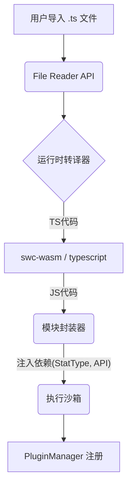

# TSAuto 插件系统重构与模组化支持方案

## 1. 现状分析

经过对 `docs/` 文档及 `src/core/plugin` 代码的审查，当前项目的插件系统存在以下特点与局限性：

### 1.1 当前架构
*   **开发环境 (Dev)**: 依赖 Vite 的 `import.meta.glob` 实现动态加载。这非常适合开发，但依赖于 Node.js/Vite 服务，无法在打包后的环境中运行。
*   **生产环境 (Prod)**: 依赖 `scripts/generate-static-plugins.js` 生成静态导入映射。这意味着所有插件必须在编译时存在，无法在运行时动态添加。
*   **资源加载 (Resource)**: 代码中存在 `resource` 模式的存根 (Stub)，但目前仅设想通过 `fetch` 加载 JSON，无法处理 TypeScript 逻辑（如 `SetEffectFunction`）。

### 1.2 差距分析
用户的核心需求是：**“无需编译打包，直接导入 TS 文件/文件夹即可生效”**。
当前系统完全**不支持**此需求，原因如下：
1.  **浏览器兼容性**: 浏览器无法直接执行 `.ts` 文件，也无法原生 `import` 本地文件系统中的 TypeScript 模块。
2.  **缺失运行时编译器**: 打包后的应用不包含 TypeScript 编译器，无法将用户提供的 TS 代码转换为浏览器可执行的 JS 代码。
3.  **模块解析限制**: 用户编写的插件通常包含 `import { StatType } from '../types'` 等语句，在运行时动态加载的环境中，这些导入路径是无效的，需要一套虚拟的模块解析机制。

---

## 2. 解决方案：运行时编译与沙箱执行系统

为了实现“真·模组化”，我们需要在游戏运行时引入“编译”和“链接”的能力。

### 2.1 核心架构变革

建议引入 **Runtime TypeScript Transpiler (运行时 TS 转译器)** 和 **Dynamic Module Linker (动态模块链接器)**。

#### 架构图示

### 2.2 关键技术选型

1.  **编译器 (Transpiler)**
    *   **推荐**: `swc-wasm` (WebAssembly 版 SWC)。
    *   **理由**: 速度极快，体积适中，支持 TypeScript 到 JavaScript 的转译。相比 `babel-standalone` 或完整 `typescript` 包，性能更好。

2.  **模块解析 (Module Resolution)**
    *   插件文件中的 `import` 语句在浏览器中无法自然工作。
    *   **方案**: 
        *   **预处理**: 在转译前/后，将 `import { X } from 'tsauto-api'` 转换为从全局对象或注入的上下文获取。
        *   **Shim**: 创建一个伪造的 `require` 或 `define` 函数，将游戏核心导出的类型和工具库（如 `StatType`, `BattleEventType`）直接注入给插件。

3.  **安全性 (Security)**
    *   允许执行任意 JS 代码存在 XSS 和安全风险。
    *   **方案**: 
        *   对于纯单机/本地工具：向用户明确发出安全警告（“您正在加载非官方代码...”）。
        *   对于更严格的安全：使用 `iframe` 沙箱或 `Web Worker`。但由于 `BattleEngine` 可能是同步调用的，使用 Worker 需要将核心战斗逻辑改造为异步消息驱动，成本巨大。建议初期采用**“主线程执行 + 严格上下文隔离”**的方式（类似于 `new Function` 但限制作用域）。

---

## 3. 实施计划

### 第一阶段：核心改造 (Infrastructure)
1.  **引入转译器**: 安装 `@swc/wasm-web` 并配置初始化流程。
2.  **构建 API 桥接**: 创建 `src/core/api-bridge/`，将所有插件开发需要的 Type、Enum、Helper 函数统一导出为一个全局可访问的 `TSAutoAPI` 对象。
3.  **重写 PluginLoader**: 
    *   实现 `loadScriptPlugin(sourceCode: string)` 方法。
    *   在该方法中调用 WASM 编译器将 TS 转为 JS。
    *   使用 `new Function('context', compiledCode)` 的方式执行插件，并将 `TSAutoAPI` 作为 context 传入。

### 第二阶段：UI 交互 (User Interface)
1.  **模组管理面板**: 开发一个新的设置页面，允许用户：
    *   点击按钮选择本地 `.ts` 文件（使用 `<input type="file">`）。
    *   拖拽文件夹导入。
2.  **持久化存储**: 使用 `IndexedDB` 存储用户导入的模组代码（因为浏览器无法直接回写本地文件系统），确保刷新页面后模组依然存在。

### 第三阶段：开发者体验 (DX)
1.  **类型定义导出**: 提供一个 `tsauto.d.ts` 文件下载，供模组开发者在 VSCode 中配置，以便获得智能提示。
2.  **热重载**: 监听文件变化（如果是本地文件系统访问 API 允许的情况下）或提供“重新加载模组”按钮。

---

## 4. 替代方案对比

| 方案 | 描述 | 优点 | 缺点 | 结论 |
| :--- | :--- | :--- | :--- | :--- |
| **A. 运行时 TS (推荐)** | 在浏览器中编译 TS | 符合用户需求，开发体验好 | 包体积增加 (~1-2MB)，有安全风险 | **采用** |
| **B. 纯数据 + DSL** | JSON 配置 + 简易脚本(Lua/Expr) | 安全，体积小 | 无法实现复杂逻辑，失去了 TS 类型优势 | 备选 |
| **C. 服务端编译** | 上传 TS 到服务器，返回 JS | 客户端轻量 | 需要后端服务，无法离线使用 | 否决 |

## 5. 下一步行动建议

建议按照 **方案 A** 进行实施。虽然增加了包体积，但这对于一款强调“模组开发能力”的游戏来说是值得的。

**待办事项 (To-Do):**
1.  [x] 在 `package.json` 中添加 `@swc/wasm-web`。
2.  [x] 编写 `TSAutoAPI` 统一导出模块。
3.  [x] 实现 `RuntimePluginLoader` 的原型（SWC + 沙箱执行）。

## 阶段 1 完成情况
- 运行时编译链路已落地：`ensureSwcInitialized` 采用 Promise 缓存，失败会重置重试。
- 新的 `RuntimePluginLoader` 使用 SWC 将 TS 转为 CJS，并通过受限 `require`(仅 `tsauto-api`) + `new Function` 沙箱执行。
- `TSAutoAPI` 作为桥接对象注入，插件可通过 `require('tsauto-api')` 或形参 `TSAutoAPI` 访问核心枚举/类型。
- 元数据自动抽取：优先 `metadata.type/id`，否则从文件名推断类型并填充默认版本/作者。
- 后续 Phase 2 聚焦 UI 导入/持久化，Phase 3 继续完善 DX 与类型分发。
